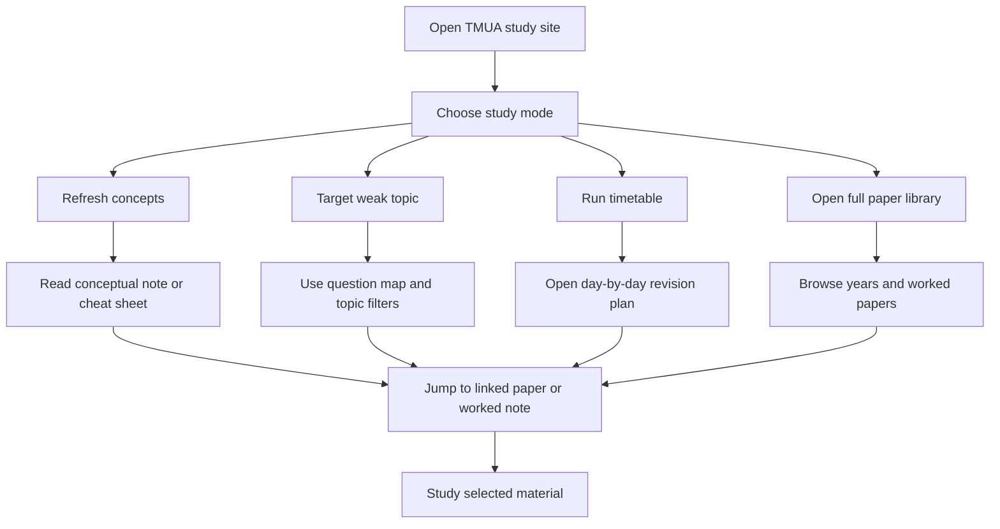

## 1. Product Overview
Create a beautiful static HTML study interface for the TMUA materials already organized in this repository.
- The product helps a student browse revision notes, question maps, worked papers, and study plans in a calmer, more visual, and more motivating way than raw Markdown files.
- The value is a premium-feeling study experience that stays GitHub-friendly and can be viewed directly through `html-preview.github.io`.

## 2. Core Features

### 2.1 Feature Module
1. **Study Home**: editorial-style landing page, study pack overview, quick-start actions, featured routes into the materials
2. **Library Explorer**: browsable view of revision notes, drill plans, question maps, and worked papers grouped by type and year
3. **Study Note Reader**: pleasant long-form reading interface for conceptual notes, cheat sheets, mistakes, and timetable content
4. **Question Map Explorer**: topic cards, recommended starting sets, stretch questions, and deep links into worked material
5. **Paper Directory**: year-by-year paper navigation with links to worked notes and source materials
6. **Search And Filters**: lightweight client-side filtering by topic, year, note type, and difficulty labels

### 2.2 Page Details
| Page Name | Module Name | Feature description |
|-----------|-------------|---------------------|
| Study Home | Hero section | Large welcome message, study pack summary, standout call-to-action buttons for starting revision |
| Study Home | Quick actions | Jump to conceptual refresh, cheat sheet, question map, 4-week timetable, latest papers |
| Study Home | Progress-style panels | Visually distinct cards for “learn”, “practice”, “review”, and “simulate” |
| Library Explorer | Sidebar navigation | Persistent section navigation for notes, plans, papers, and worked solutions |
| Library Explorer | Content cards | Rich cards with labels, descriptions, topic tags, and clear deep-link buttons |
| Study Note Reader | Reader layout | Comfortable typography, sticky table of contents, section anchors, and reading progress |
| Question Map Explorer | Topic grid | Cards for algebra, graphs, trig, geometry, circles, sequences, calculus, and logic |
| Question Map Explorer | Guided practice | Display best starting set, best paper, stretch tasks, and why each set matters |
| Paper Directory | Paper timeline | Clean year-grouped layout for Practice, Specimen, and annual papers |
| Paper Directory | Deep links | Buttons to open worked note anchors and source markdown files |
| Global UI | Search/filter bar | Client-side filtering across note metadata and paper listings |
| Global UI | Theme and motion | Rich visual theme, subtle transitions, hover states, section reveals, and ambient effects |

## 3. Core Process
The user lands on the home page, understands the structure of the TMUA study pack, and chooses an entry path such as “refresh concepts”, “start drilling”, or “open papers”. They then browse filtered content, open a study note in a dedicated reader, or jump into the question map to locate topic-specific practice. From any note or topic page, they can follow deep links back to the exact paper or worked note section they need.

## 4. User Interface Design
### 4.1 Design Style
- Primary colors: deep ink navy, parchment ivory, muted gold accent, and cool slate for structure
- Button style: softly rounded, high-contrast editorial buttons with layered hover shadows
- Font and sizes: a distinctive serif display face for headings and a refined readable serif or humanist body face for long reading
- Layout style: desktop-first editorial dashboard with split panels, asymmetrical grids, sticky navigation, and reader-centric spacing
- Icon style suggestions: minimal line icons used sparingly, with elegant dividers and rule lines rather than icon-heavy UI

### 4.2 Page Design Overview
| Page Name | Module Name | UI Elements |
|-----------|-------------|-------------|
| Study Home | Hero section | Full-width editorial masthead, textured background, oversized heading, layered cards, gentle entrance animation |
| Study Home | Quick actions | Rich navigation tiles with topic labels, duration hints, and hover lift effects |
| Library Explorer | Sidebar navigation | Sticky left rail, section chips, subtle active-state indicator, smooth anchor scrolling |
| Library Explorer | Content cards | Neutral card surfaces, gold rule lines, metadata labels, hover glow, and readable summaries |
| Study Note Reader | Reader layout | Narrow reading column, sticky section list, progress rail, in-page anchors, elegant typographic rhythm |
| Question Map Explorer | Topic grid | Responsive card grid, tag chips, recommended order callouts, and paper-link buttons |
| Paper Directory | Paper timeline | Vertical year markers, grouped cards, quick open links, and source/worked split actions |

### 4.3 Responsiveness
Desktop-first design with strong laptop and large-screen layouts, then adaptive tablet and mobile behavior. On smaller screens, sidebar panels collapse into stacked sections, cards become single-column, and sticky elements degrade gracefully into top navigation and collapsible tables of contents.
