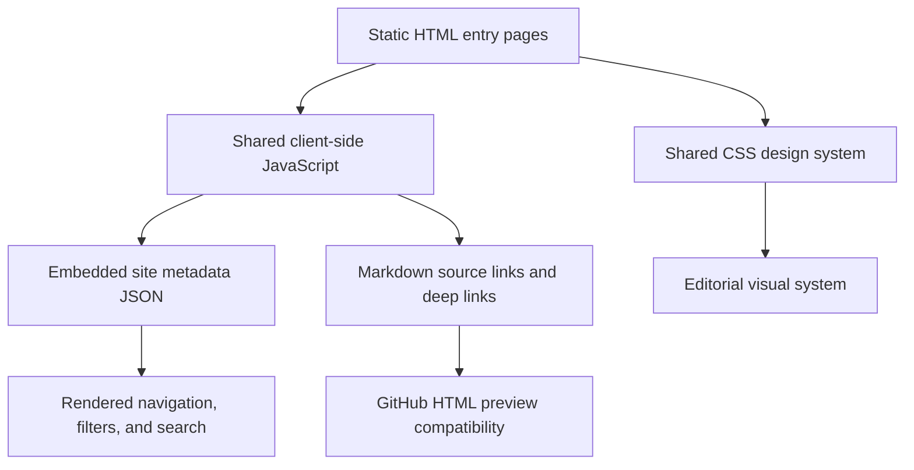
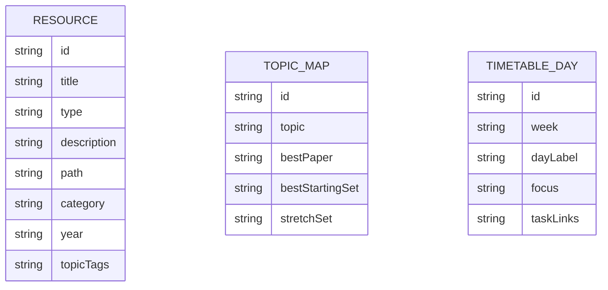

## 1. Architecture Design

## 2. Technology Description
- Frontend: handcrafted HTML5 + CSS3 + vanilla JavaScript (ES2020)
- Styling: shared CSS using custom properties, layered gradients, typography scale, card system, and motion utilities
- Data source: repository-authored metadata JSON generated manually for the first version and expandable later
- Hosting/preview model: static files committed to the repository and viewable through `html-preview.github.io`

## 3. Route Definitions
| Route | Purpose |
|-------|---------|
| `/resources/maths/tmua/site/index.html` | Study home page with overview and entry paths |
| `/resources/maths/tmua/site/library.html` | Unified library explorer for notes, plans, and paper collections |
| `/resources/maths/tmua/site/reader.html` | Study note reader for conceptual material and long-form notes |
| `/resources/maths/tmua/site/question-map.html` | Topic-based question explorer with guided practice routes |
| `/resources/maths/tmua/site/papers.html` | Year-by-year paper directory and worked-note links |

## 4. Data Model
### 4.1 Data Model Definition

### 4.2 Data Definition Language
No database is required for version 1.

The site will use one or more static JSON files, for example:

- `resources/maths/tmua/site/data/resources.json`
- `resources/maths/tmua/site/data/question-map.json`
- `resources/maths/tmua/site/data/timetable.json`

## 5. Implementation Notes
- Use a static architecture rather than React because the explicit requirement is compatibility with `html-preview.github.io`, which favors zero-build HTML pages committed directly in the repository.
- Keep the UI modular by separating `index.html`, `library.html`, `reader.html`, `question-map.html`, `papers.html`, shared `styles.css`, shared `app.js`, and small topic-specific data files.
- Use relative links only so pages work both locally and through GitHub HTML preview.
- Preserve direct access to source Markdown and worked-note anchors instead of converting all Markdown into HTML in the first version.
- For the reader page, ship curated HTML renderings of the main study notes and use metadata-driven navigation for the rest of the library.
- Prefer progressive enhancement: the content must remain navigable if JavaScript fails, with search and filtering treated as enhancements.
- Design direction: “scholarly editorial”, combining premium textbook calmness with modern interactive affordances.
